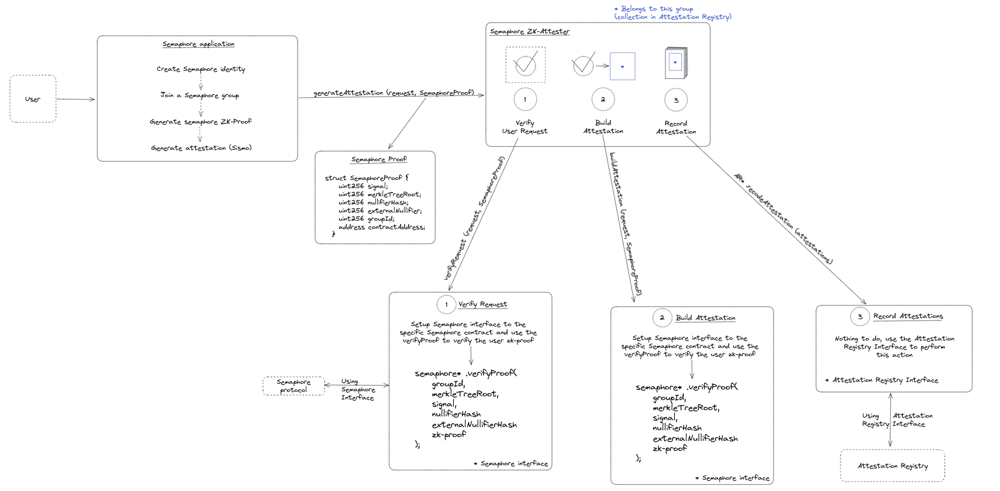

# SismoC

Creation of a zero-knowledge attester on chain, using the Semaphore protocol, with the goal of integrating it with the other Sismo attesters.

## How does it work?

  

## Getting Started

### Installation
⚠️ To use this project, please be sure to run the following command at the root of the repository : `nvm use`

Clone the [sismo-core repository](https://github.com/sismo-core/sismo-protocol) as `sismo-protocol-main/` in `./sismo/contracts` to make the attester works

You must install all dependencies for the Semaphore application, Semaphore contract and Sismo attester using `npm install` or `yarn`.

### Usage
#### Setup project
1. Deploy the Semaphore contracts
2. Setup a `./sismo/.env` using `./sismo/.env.example`
3. Deploy the Attester contracts
4. Setup a `./semaphore-app/.env` using `./semaphore-app/.env.example`
5. Run the Semaphore app : `yarn start`

#### Create semaphore identity & get attestation
On the Semaphore app, follow the instructions on the user interface

1. Create identidy
2. Join Group
3. Generate attestation

## Get involved

You're invited to join this project ! Check out the [contributing guide](./CONTRIBUTING.md).

If you're interested in how the project is organized at a higher level, please contact the current project manager.

## Our PoC team :heart:

Developers
| [ Léo Dubosclard](https://github.com/ZerLock) | [ Alex PREVOT](https://github.com/Alex-Prevot) | [ Victor Guyot](https://github.com/MrSIooth)
| :---: | :---: | :---: |

Manager
| [ Ismaël FALL](https://github.com/Doozers)
| :---: |

<h2 align=center>
Organization
</h2>

    
    
    
    

    

> :rocket: Don't hesitate to follow us on our different networks, and put a star 🌟 on `PoC's` repositories

> Made with :heart: by PoC
